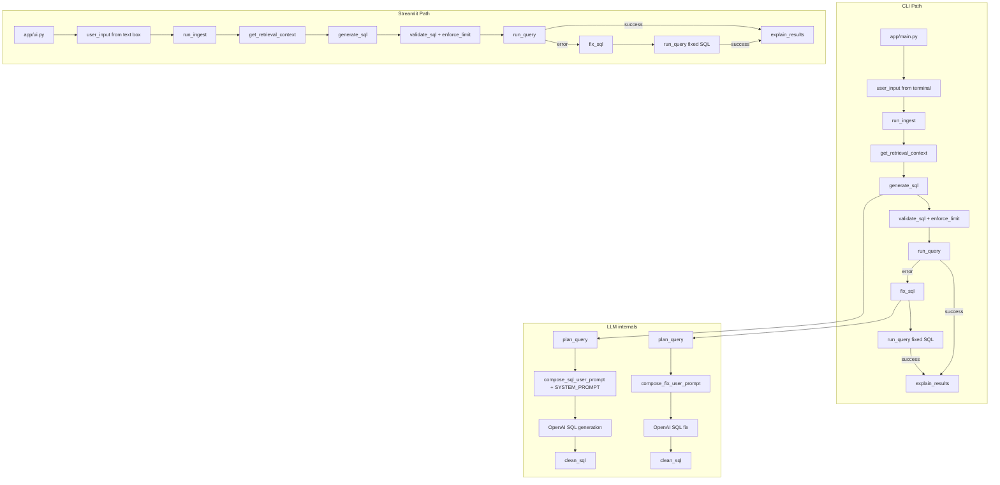
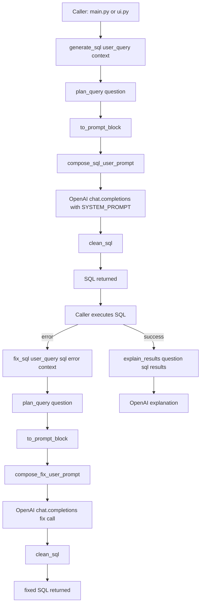

# LLM Function Flow

## Function Sequence

1. `generate_sql(...)` in `app/llm/generate_sql.py`
   - Main SQL generation entrypoint.
   - Calls planner, composes prompt, calls LLM, normalizes SQL text.
2. `plan_query(...)` in `app/llm/planner.py`
   - Lightweight parser of the question.
   - Infers intent, time grain, entities, and optional top-k hint.
3. `QueryPlan.to_prompt_block(...)` in `app/llm/planner.py`
   - Converts plan output into a text block added to the prompt.
4. `compose_sql_user_prompt(...)` in `app/llm/prompts.py`
   - Builds SQL-generation user prompt from context + plan + question.
5. LLM generation call in `generate_sql(...)`
   - Uses `SYSTEM_PROMPT` plus composed user prompt.
6. `clean_sql(...)` in `app/llm/generate_sql.py`
   - Removes markdown fences and trims whitespace.
7. `fix_sql(...)` in `app/llm/generate_sql.py` (error path)
   - Repeats planning + prompt composition with failed SQL and DB error.
   - Returns corrected SQL from the LLM.
8. `explain_results(...)` in `app/llm/explain_results.py`
   - Separate LLM call that explains query output in plain English.

## app/llm Only Flowchart

