# RAG Function Call Graph

This diagram focuses on function-level calls within `app/rag/*`.

```mermaid
flowchart TD
  A1["context_service.get_retrieval_context"] --> A2["context_service.build_context"]
  A1 --> A3["retriever.retrieve_relevant_docs"]

  B1["embeddings.get_active_schema_path"] --> B2["embeddings._resolve_schema_path"]
  B3["embeddings.load_schema_docs"] --> B4["embeddings._normalize_docs"]
  B3 --> B2
  B5["embeddings.generate_embeddings"] --> B6["embeddings.format_doc"]

  C1["ingest.run_ingest"] --> C2["embeddings.generate_embeddings"]
  C1 --> C3["embeddings.load_schema_docs"]
  C1 --> C4["ingest._log_startup_once"]
  C1 --> C5["ingest.compute_schema_hash"]
  C1 --> C6["ingest.has_schema_changed"]
  C1 --> C7["ingest.save_hash"]
  C1 --> C8["vector_store.get_chroma_client"]
  C1 --> C9["vector_store.get_collection"]
  C1 --> C10["vector_store.store_embeddings"]
  C6 --> C11["ingest._state_file"]
  C7 --> C11
  C4 --> B1
  C4 --> C12["vector_store.get_chroma_mode"]

  D1["retriever.retrieve_relevant_docs"] --> B6
  D1 --> B3
  D1 --> C9
  D1 --> D2["vector_store.query_collection"]

  E1["retriever_experimental.retrieve_relevant_docs_experimental"] --> B6
  E1 --> B3
  E1 --> E2["retriever_experimental._score_table_doc"]
  E1 --> E3["retriever_experimental._tokens"]
  E1 --> C9
  E1 --> D2
  E2 --> E4["retriever_experimental._parse_columns"]
  E2 --> E5["retriever_experimental._parse_table_name"]
  E2 --> E3

  F1["kpi_catalog.load_kpi_catalog"] --> F2["kpi_catalog.validate_kpi_catalog"]
  F2 --> F3["kpi_catalog._validate_entry"]

  G1["vector_store.get_collection"] --> G2["vector_store._collection_name"]
  G1 --> C8
  C8 --> G3["vector_store._is_ephemeral_env"]
  C12 --> G3
```

## Notes

- Scope: functions inside `app/rag/*`.
- Static call graph: dynamic/runtime dispatch is not fully represented.
