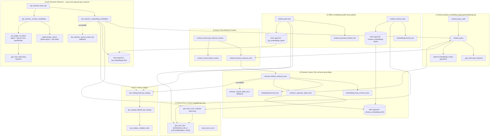

# RAG Function Call Graph

This diagram focuses on function-level calls within `app/rag/*`, plus the shared Neon
resolver (`app/db/neon.py`) and the KPI semantic-retrieval path in `app/llm/kpi_matcher.py`.

```mermaid
flowchart TB
  %% Single Neon pgvector backend; the question is embedded once and shared.

  subgraph S0["0) Shared Neon resolver (app/db/neon.py)"]
    direction TB
    N1["get_neon_dsn  (DATABASE_URL or st.secrets[postgres_neon])"]
    N2["get_neon_conn  (cached read-only)"] --> N1
    N3["reset_neon_conn"]
  end

  subgraph S1["1) Shared question embedding (app/rag/embeddings.py)"]
    direction TB
    A1["embed_query_safe"] --> A2["embed_query"]
    A2 --> A3["_get_client  (lazy OpenAI)"]
    A2 --> A4["OpenAI embeddings.create (question)"]
  end

  subgraph S2["2) Query-Time Retrieval Context"]
    direction TB
    C1["context_service.get_retrieval_context"] --> C2["retriever.retrieve_relevant_docs"]
    C1 --> C3["context_service.build_context"]
  end

  subgraph S3["3) Retriever Query Flow (schema grounding)"]
    direction TB
    D1["retriever.retrieve_relevant_docs"] --> D2["embeddings.load_schema_docs"]
    D1 --> D3["embeddings.format_doc"]
    D1 --> D4["retriever._pgvector_table_docs"]
    D4 --> A2
    D4 --> N2
    D4 --> D5[("Neon pgvector: schema_embeddings kNN")]
    D1 -. unavailable .-> D6["retriever._lexical_table_docs (fallback)"]
  end

  subgraph S4["4) KPI Catalog Utilities"]
    direction TB
    E1["kpi_catalog.load_kpi_catalog"] --> E2["kpi_catalog.validate_kpi_catalog"]
    E2 --> E3["kpi_catalog._validate_entry"]
  end

  subgraph S5["5) Offline embedding builds (hash-gated)"]
    direction TB
    F1["embed_kpis.main"] --> F2["embed_kpis.build_embed_text"]
    F1 --> E1
    F1 --> N1
    F1 --> F3[("Neon pgvector: kpi_embeddings upsert")]
    H1["embed_schema.main"] --> H2["embeddings.format_doc"]
    H1 --> N1
    H1 --> H3[("Neon pgvector: schema_embeddings upsert")]
  end

  subgraph S6["6) KPI Semantic Retrieval — query time (app.llm.kpi_matcher)"]
    direction TB
    G1["kpi_matcher.match_kpi"] --> G2["kpi_matcher._embedding_candidates"]
    G2 --> A2
    G2 --> N2
    G2 --> G4[("Neon pgvector: kpi_embeddings kNN")]
    G2 --> E1
    G1 --> G5["kpi_matcher._resolve_candidates"]
    G5 --> G7["_deterministic_winner  (literal signal -> fast-path)"]
    G5 --> G8["_llm_judge  (no literal signal -> gpt-4o-mini, pick/NONE)"]
    G8 --> G9["_get_chat_client (lazy OpenAI)"]
    G2 -. unavailable .-> G6["kpi_matcher._lexical_match_kpi (fallback)"]
  end

  %% Cross-subsystem ordering
  A2 --> C2
  C2 --> D1
  D1 --> E1
  F3 --> G4
  H3 --> D5
```

## Notes

- **Single backend now.** Both retrieval concerns read from Neon `pgvector`:
  - schema grounding: `retriever -> schema_embeddings` (S3).
  - KPI routing: `kpi_matcher -> kpi_embeddings` (S6).
- **One embedding per question.** The orchestration calls `embed_query_safe` once and threads
  the vector into both paths (`query_embedding` argument); each path embeds itself only if no
  vector is supplied (e.g. the eval runners).
- **Shared Neon resolver** `app/db/neon.py` (S0) resolves credentials from `DATABASE_URL` or
  `st.secrets["postgres_neon"]`, so the pgvector layer works in CLI and on Streamlit Cloud.
- **LLM judge** runs only when the shortlist has no literal name/alias signal (paraphrase) or
  may be a non-KPI question; it returns a pick or NONE (schema fallback). Canonical-vocab
  questions stay on `_deterministic_winner` with no LLM call.
- `embed_kpis.py` / `embed_schema.py` are the offline, hash-gated builds.
- Graceful degradation: `retriever` and `kpi_matcher` fall back to lexical scoring if
  OpenAI/Neon are unavailable; the judge falls back to the deterministic winner.
- **Removed in Phase 1.7**: `app/rag/ingest.py`, `app/rag/vector_store.py` (Chroma), and
  `app/rag/retriever_experimental.py` were deleted; `chromadb` dropped from requirements.
- Static call graph: dynamic/runtime dispatch is not fully represented.
