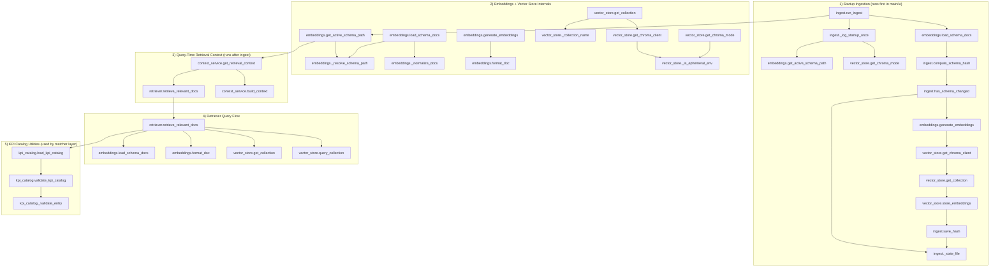

# RAG Function Call Graph

This diagram focuses on function-level calls within `app/rag/*`.

```mermaid
flowchart TB
  %% Ordered by runtime sequence: startup ingest -> query retrieval -> optional modules

  subgraph S1["1) Startup Ingestion (runs first in main/ui)"]
    direction TB
    A1["ingest.run_ingest"] --> A2["ingest._log_startup_once"]
    A2 --> A3["embeddings.get_active_schema_path"]
    A2 --> A4["vector_store.get_chroma_mode"]
    A1 --> A5["embeddings.load_schema_docs"]
    A5 --> A6["ingest.compute_schema_hash"]
    A6 --> A7["ingest.has_schema_changed"]
    A7 --> A8["ingest._state_file"]
    A7 --> A9["embeddings.generate_embeddings"]
    A9 --> A10["vector_store.get_chroma_client"]
    A10 --> A11["vector_store.get_collection"]
    A11 --> A12["vector_store.store_embeddings"]
    A12 --> A13["ingest.save_hash"]
    A13 --> A8
  end

  subgraph S2["2) Embeddings + Vector Store Internals"]
    direction TB
    B1["embeddings.get_active_schema_path"] --> B2["embeddings._resolve_schema_path"]
    B3["embeddings.load_schema_docs"] --> B2
    B3 --> B4["embeddings._normalize_docs"]
    B5["embeddings.generate_embeddings"] --> B6["embeddings.format_doc"]
    B7["vector_store.get_collection"] --> B8["vector_store._collection_name"]
    B7 --> B9["vector_store.get_chroma_client"]
    B9 --> B10["vector_store._is_ephemeral_env"]
    B11["vector_store.get_chroma_mode"] --> B10
  end

  subgraph S3["3) Query-Time Retrieval Context (runs after ingest)"]
    direction TB
    C1["context_service.get_retrieval_context"] --> C2["retriever.retrieve_relevant_docs"]
    C1 --> C3["context_service.build_context"]
  end

  subgraph S4["4) Retriever Query Flow"]
    direction TB
    D1["retriever.retrieve_relevant_docs"] --> D2["embeddings.load_schema_docs"]
    D1 --> D3["embeddings.format_doc"]
    D1 --> D4["vector_store.get_collection"]
    D1 --> D5["vector_store.query_collection"]
  end

  subgraph S5["5) KPI Catalog Utilities (used by matcher layer)"]
    direction TB
    E1["kpi_catalog.load_kpi_catalog"] --> E2["kpi_catalog.validate_kpi_catalog"]
    E2 --> E3["kpi_catalog._validate_entry"]
  end

  %% Force top-down subsystem ordering between groups.
  A1 --> B1
  B1 --> C1
  C2 --> D1
  D1 --> E1
```

## Notes

- Scope: functions inside `app/rag/*`.
- Runtime sequence in `main.py` / `ui.py`: `run_ingest()` then `get_retrieval_context(...)`.
- Query-time retrieval path: `context_service -> retriever -> embeddings/vector_store`.
- `retriever_experimental.py` is intentionally excluded from the active docs flow.
- Static call graph: dynamic/runtime dispatch is not fully represented.

