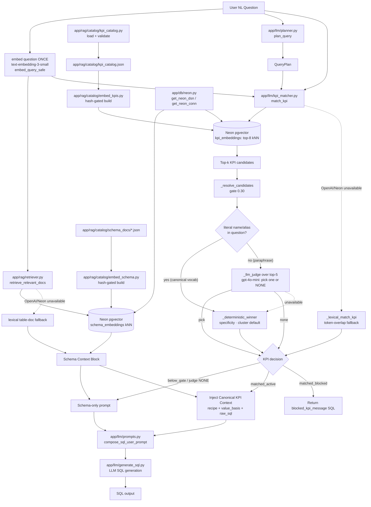

# KPI Processing Flow (current — implemented)

> Both RAG paths run on a **single Neon `pgvector` backend** and share **one** question
> embedding. Schema grounding retrieves table docs from `schema_embeddings`; KPI routing
> retrieves the nearest KPIs from `kpi_embeddings`, resolves them with deterministic rules,
> and — for paraphrases / possibly-non-KPI questions — an **LLM judge over the top-5** picks
> one candidate or NONE. A lexical scorer is the fallback when OpenAI/Neon are unavailable.
> (Phase 1.7 converged the previously separate Chroma schema path and double embedding.)

## File Responsibilities
- `app/db/neon.py` (`get_neon_dsn`, `get_neon_conn`, `reset_neon_conn`)
  - Single Neon credential resolver for the pgvector layer: `DATABASE_URL` → else a DSN built
    from `st.secrets["postgres_neon"]`. Closes the Streamlit secrets gap (so the matcher and
    schema retrieval don't silently fall to lexical in the cloud). Used by `kpi_matcher`,
    `retriever`, and the offline embed scripts.

- `app/rag/embeddings.py` (`embed_query`, `embed_query_safe`, `format_doc`, `load_schema_docs`)
  - Lazy OpenAI client + the shared one-shot question embedding. `embed_query_safe` returns
    `None` on failure so callers fall back gracefully.

- `app/rag/retriever.py` (`retrieve_relevant_docs`, `_pgvector_table_docs`, `_lexical_table_docs`)
  - Lexical metric-doc matching (deterministic) + semantic table-doc retrieval from Neon
    `schema_embeddings` (kNN). Accepts a precomputed `query_embedding`. Falls back to
    token-overlap table docs when OpenAI/Neon are unavailable.

- `app/llm/planner.py` (`plan_query`)
  - Deterministic intent/time-grain/entity extraction; handles `last 7 days`, `past 30 days`.

- `app/llm/kpi_matcher.py` (`match_kpi`, `_embedding_candidates`, `_resolve_candidates`,
  `_deterministic_winner`, `_llm_judge`, `_lexical_match_kpi`)
  - Retrieves top-k KPIs from `kpi_embeddings`, applies the similarity gate, then resolves:
    canonical vocab (a literal name/alias substring present) → deterministic fast-path;
    otherwise the **LLM judge** picks one of the top-5 or NONE. Lexical token-overlap fallback
    when the vector store is unavailable. Returns `KpiMatchDecision`.

- `app/rag/catalog/embed_kpis.py` / `embed_schema.py`
  - Offline, hash-gated builds of the two pgvector indexes (`kpi_embeddings`,
    `schema_embeddings`). Re-run after catalog / schema-doc edits.

- `app/rag/catalog/kpi_catalog.py` / `kpi_catalog.json`
  - Runtime source of truth and validated entry contract; the content the embeddings derive from.

- `app/llm/prompts.py` / `app/llm/generate_sql.py`
  - Compose schema + plan + KPI block; inject the directive recipe (`value_basis`, filters,
    `raw_sql`); handle the blocked-KPI route. The orchestration embeds the question once and
    shares it with both retrieval paths.

- `app/eval/run_planner_kpi_eval.py` / `run_sql_correctness_eval.py` / `run_paraphrase_eval.py`
  - Routing regression; catalog-driven SQL-correctness assertions; held-out matcher precision
    and abstention.

## Execution Sequence
1. Embed the question **once** (`embed_query_safe`) and share the vector with both paths.
2. Retrieve schema context from Neon `schema_embeddings` (lexical fallback offline).
3. Build deterministic plan (`intent`, `time_grain`, entities).
4. Retrieve top-k KPI candidates from `kpi_embeddings`; apply the similarity gate.
5. Resolve: literal signal → deterministic winner; paraphrase → LLM judge (pick / NONE);
   judge unavailable → deterministic winner. Apply the leaderboard guardrail → `KpiMatchDecision`.
6. Compose the final prompt (schema + plan + optional KPI block) and generate SQL (or blocked SQL).
7. Evaluate matcher precision and SQL correctness offline via the eval harnesses.

## Important Guardrails
- KPI layer is optional; below-gate questions and judge-`NONE` verdicts fall back to schema-only.
- Canonical-vocabulary questions use the deterministic fast-path (no judge call), so routing stays stable.
- Blocked KPIs stay explicit (`blocked_by_missing_data`) with dependency messaging.
- Leaderboard KPIs require ranking intent language (applied after the judge's pick).
- The catalog is flat (no tiers); priority among look-alikes is handled by the resolver/judge.
- pgvector indexes are catalog/schema-derived and env-independent (read from Neon regardless of `DB_ENV`).

## Resolved limitation
- The numeric similarity gate alone could not separate schema-exploration questions
  (e.g. "sample the issuers table") that overlap the KPI band. The **LLM judge with a NONE
  option** now abstains on those (negatives abstention 5/12 → 12/12) and re-ranks paraphrases
  (precision 72.6% → 93.5%, at the recall@5 ceiling).
