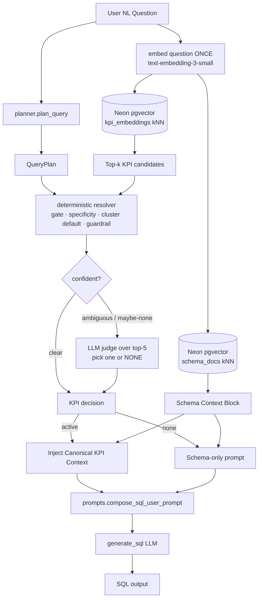

# KPI Processing Flow — Future (Phase 1.7 unification)

> The embedding-shortlist matcher is now implemented (see `kpi_processing_flow.md`). This
> doc captures the remaining convergence work: one question embedding shared across both
> retrieval paths, a single persistent vector backend, and an optional LLM judge over the
> shortlist to fix the abstention/precision ceiling.

## Why
Today there are two retrieval paths with two issues:
- **Two embedding calls per question** — `retriever.py` (schema) and `kpi_matcher.py` (KPI)
  each embed the same question with the same model.
- **Two backends** — schema docs live in Chroma (ephemeral; re-embedded on Streamlit cold
  start), KPI vectors live in Neon `pgvector` (persistent). Inconsistent persistence.
- **Gate cannot abstain on schema-exploration** — those questions overlap the KPI band, so
  the numeric similarity gate alone leaks them into a KPI match.

## Target changes
1. **Embed the question once** and share the vector between schema retrieval and KPI
   matching (removes the duplicate embedding call). Requires threading the embedding through
   the orchestration (`generate_sql` / `main` / `ui`).
2. **Single backend** — migrate `schema_docs` embeddings into Neon `pgvector` alongside
   `kpi_embeddings`. Removes Chroma and the Streamlit cold-start re-embed entirely; one
   persistent store, one ops story.
3. **LLM judge over the shortlist** — when the embedding shortlist is ambiguous or possibly
   non-KPI, ask the model to pick one of the top-5 or NONE. This closes both gaps the gate
   cannot: the 73% → ~97% precision ceiling (recall@5 = 97%) and abstention on
   schema-exploration questions that overlap the KPI band. Cost: one cheap call per
   ambiguous question.

## Not in scope here
- Downstream prompt/recipe injection and the blocked-KPI route are unchanged.
- `KpiMatchDecision` stays the same, so `generate_sql`/`ui` interfaces are unaffected.
