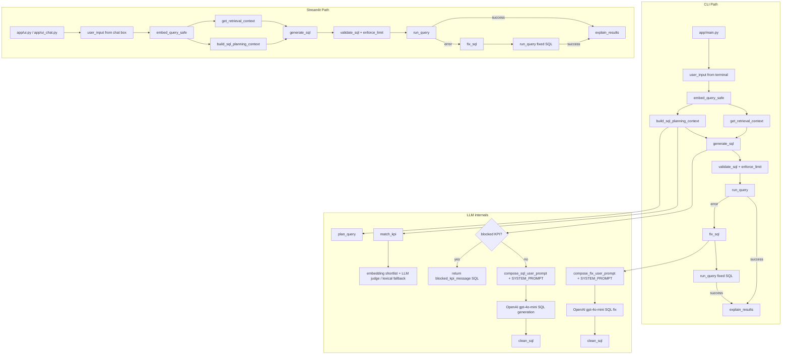
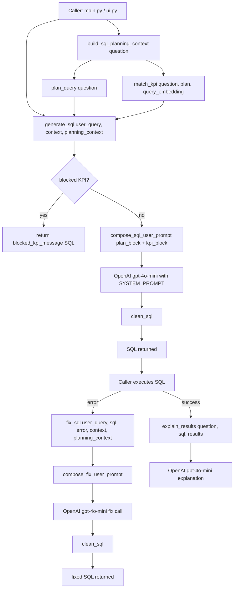

# LLM Function Flow

Both entrypoints (`app/main.py` CLI and `app/ui.py` / `app/ui_chat.py` Streamlit) share the same
orchestration: embed the question **once**, retrieve schema context, compute deterministic planning
+ KPI routing, generate SQL, validate, execute, and (on error) repair once.

## Function Sequence

1. `embed_query_safe(...)` in `app/rag/embeddings.py`
   - Embeds the question once (`text-embedding-3-small`); the vector is shared with schema
     retrieval and KPI matching so the question is never re-embedded.
   - Returns `None` when OpenAI is unavailable (downstream paths fall back to lexical).
2. `get_retrieval_context(question, query_embedding=...)` in `app/rag/context_service.py`
   - Schema grounding: kNN over Neon `pgvector` `schema_embeddings`, formatted into the context text.
3. `build_sql_planning_context(question, query_embedding=...)` in `app/llm/generate_sql.py`
   - `plan_query(...)` in `app/llm/planner.py` — infers intent, time grain, entities, optional top-k.
   - `match_kpi(...)` in `app/llm/kpi_matcher.py` — embedding shortlist from `kpi_embeddings` +
     deterministic fast-path / `gpt-4o-mini` LLM judge; lexical fallback when OpenAI/Neon are down.
   - Returns a reusable `SqlPlanningContext(plan, kpi_decision)` used by both generate and fix.
4. `generate_sql(question, context, planning_context=...)` in `app/llm/generate_sql.py`
   - Blocked KPI → returns a safe `blocked_kpi_message` SELECT (no fabricated SQL).
   - Otherwise composes the prompt (`compose_sql_user_prompt` with plan + KPI blocks) and calls
     `gpt-4o-mini` (temperature 0), then `clean_sql`.
5. `clean_sql(...)` in `app/llm/generate_sql.py`
   - Removes markdown fences and trims whitespace.
6. `fix_sql(...)` in `app/llm/generate_sql.py` (error path)
   - Reuses the same `planning_context`; composes `compose_fix_user_prompt` with the failed SQL and
     DB error; returns corrected SQL from `gpt-4o-mini`.
7. `explain_results(...)` in `app/llm/explain_results.py`
   - Separate `gpt-4o-mini` call that explains query output in plain English.

## app/llm Only Flowchart

> See `module_call_graph.md` and `function_call_graph_rag.md` for the full module/function graphs,
> including the Neon `pgvector` backend and the offline embedding builds.
