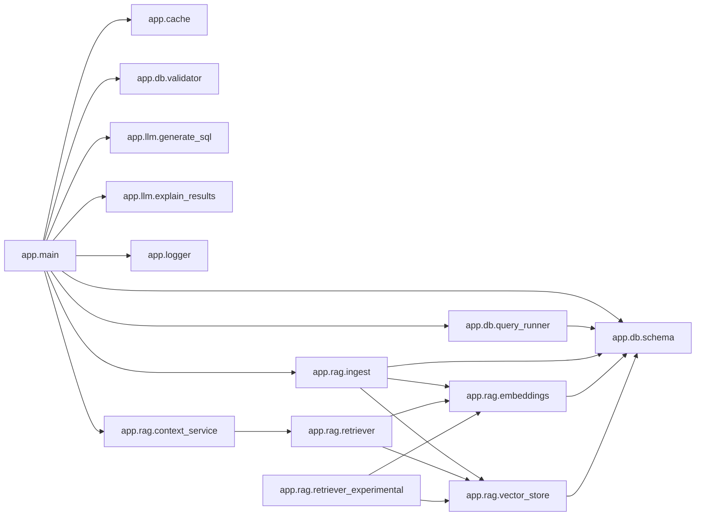

# Module Call Graph

This high-level diagram shows which modules call into other modules.

## Notes

- Scope: module-to-module calls discovered from `app/**/*.py`.
- This is intended for architecture-level discussion and presentations.
