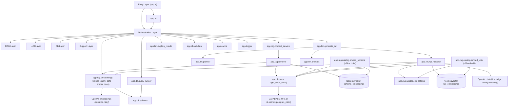

# Module Call Graph (v2)

This high-level diagram shows runtime module dependencies in a layered vertical layout.

```mermaid
flowchart TB
  E0["Entry Layer (app.ui)"] --> O0["Orchestration Layer"]
  O0 --> R0["RAG Layer"]
  O0 --> L0["LLM Layer"]
  O0 --> D0["DB Layer"]
  O0 --> X0["Support Layer"]

  E0 --> U0["app.ui"]
  U0 --> O0

  O0 --> RC["app.rag.context_service"]
  O0 --> RE["app.rag.embeddings (embed_query_safe — embed once)"]
  O0 --> LG["app.llm.generate_sql"]
  O0 --> LE["app.llm.explain_results"]
  O0 --> DV["app.db.validator"]
  O0 --> DQ["app.db.query_runner"]
  O0 --> CA["app.cache"]
  O0 --> LO["app.logger"]

  RC --> RR["app.rag.retriever"]
  RR --> RE
  RR --> NE["app.db.neon (get_neon_conn)"]
  RR --> SV[("Neon pgvector: schema_embeddings")]
  ES["app.rag.catalog.embed_schema (offline build)"] --> SV
  ES --> NE

  LG --> LP["app.llm.planner"]
  LG --> LK["app.llm.kpi_matcher"]
  LG --> LPR["app.llm.prompts"]

  LK --> KC["app.rag.catalog.kpi_catalog"]
  LK --> RE
  LK --> NE
  LK --> KV[("Neon pgvector: kpi_embeddings")]
  LK --> OJ["OpenAI chat (LLM judge, ambiguous-only)"]
  EK["app.rag.catalog.embed_kpis (offline build)"] --> KV
  EK --> KC
  EK --> NE

  RE --> OE["OpenAI embeddings (question, lazy)"]
  RE --> DS["app.db.schema"]
  NE --> SEC["DATABASE_URL or st.secrets[postgres_neon]"]
  DQ --> DS
```

## Notes

- Scope: runtime-oriented module dependencies from `app/**/*.py`.
- Entry layer in this v2 runtime view is the Streamlit app (`app.ui`).
- Arrow meaning: left module calls/imports and depends on right module.
- **Single Neon `pgvector` backend** for both RAG paths: `retriever -> schema_embeddings`
  (schema grounding) and `kpi_matcher -> kpi_embeddings` (KPI routing). Both go through the
  shared resolver `app.db.neon` (`DATABASE_URL` or `st.secrets[postgres_neon]`).
- **Question embedded once**: the orchestration calls `app.rag.embeddings.embed_query_safe`
  and shares the vector with both `context_service` and `generate_sql` (KPI matcher).
- `app.llm.kpi_matcher` resolves the shortlist deterministically when a literal name/alias is
  present, otherwise via an **LLM judge** (`gpt-4o-mini`, pick-one-or-NONE). Falls back to its
  lexical scorer when OpenAI/Neon are unavailable. `embed_kpis` / `embed_schema` are the
  offline builds that populate the two pgvector tables.
- **Removed in Phase 1.7**: `app.rag.ingest`, `app.rag.vector_store` (Chroma), and
  `app.rag.retriever_experimental` were deleted. `app.llm.metric_resolver` was removed earlier
  (its responsibilities are covered by the KPI matcher).
