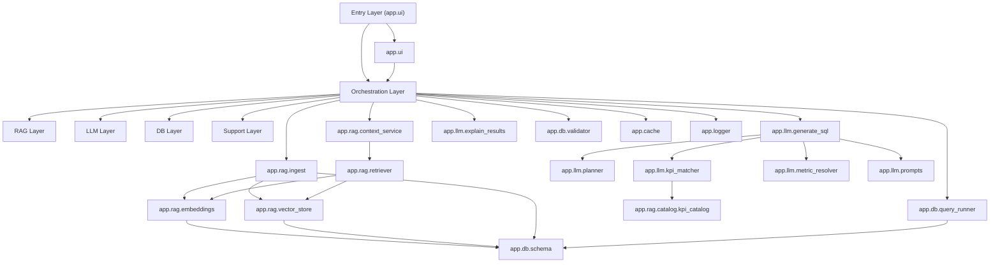

# Module Call Graph (v2)

This high-level diagram shows runtime module dependencies in a layered vertical layout.

```mermaid
flowchart TB
  E0["Entry Layer (app.ui)"] --> O0["Orchestration Layer"]
  O0 --> R0["RAG Layer"]
  O0 --> L0["LLM Layer"]
  O0 --> D0["DB Layer"]
  O0 --> X0["Support Layer"]

  E0 --> U0["app.ui"]
  U0 --> O0

  O0 --> RI["app.rag.ingest"]
  O0 --> RC["app.rag.context_service"]
  O0 --> LG["app.llm.generate_sql"]
  O0 --> LE["app.llm.explain_results"]
  O0 --> DV["app.db.validator"]
  O0 --> DQ["app.db.query_runner"]
  O0 --> CA["app.cache"]
  O0 --> LO["app.logger"]

  RC --> RR["app.rag.retriever"]
  RI --> RE["app.rag.embeddings"]
  RI --> RV["app.rag.vector_store"]

  RR --> RE
  RR --> RV

  LG --> LP["app.llm.planner"]
  LG --> LK["app.llm.kpi_matcher"]
  LG --> LM["app.llm.metric_resolver"]
  LG --> LPR["app.llm.prompts"]

  LK --> KC["app.rag.catalog.kpi_catalog"]

  RE --> DS["app.db.schema"]
  RV --> DS
  RI --> DS
  DQ --> DS
```

## Notes

- Scope: runtime-oriented module dependencies from `app/**/*.py`.
- Entry layer in this v2 runtime view is the Streamlit app (`app.ui`).
- Arrow meaning: left module calls/imports and depends on right module.
- `app.rag.retriever_experimental` is intentionally excluded from runtime v2 graph.
