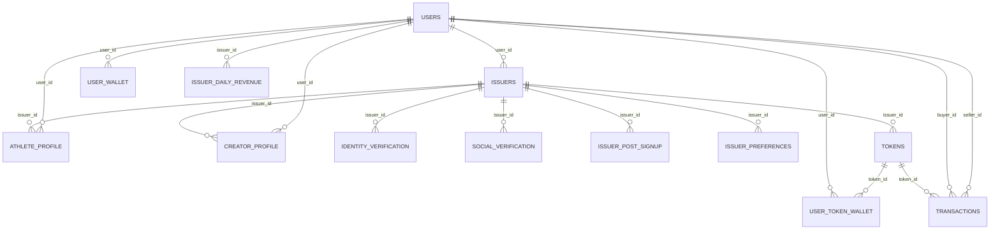
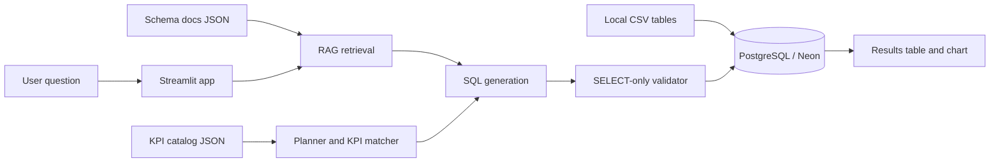

# ATHL Streamlit Cloud Data Guide

This guide explains how to use the ATHL Streamlit app as a data documentation and analytics workspace on Streamlit Community Cloud.

## Streamlit Cloud Setup

Use these deployment settings:

| Setting | Value |
| --- | --- |
| Entrypoint | `app/ui.py` |
| Python | `3.11` from `runtime.txt` |
| Dependencies | `requirements.txt` |
| Database mode | `DB_ENV = "prod"` |
| Public app surface | Schema explorer, lineage, metric docs, and optional AI chat |

Streamlit Community Cloud runs `streamlit run` from the repository root, installs dependencies from `requirements.txt`, and lets you paste secrets through advanced settings. Official references:

- [Deploy your app on Community Cloud](https://docs.streamlit.io/deploy/streamlit-community-cloud/deploy-your-app/deploy)
- [File organization](https://docs.streamlit.io/deploy/streamlit-community-cloud/deploy-your-app/file-organization)
- [App dependencies](https://docs.streamlit.io/deploy/streamlit-community-cloud/deploy-your-app/app-dependencies)
- [Secrets management](https://docs.streamlit.io/deploy/concepts/secrets)

## Required Secrets

The documentation tabs run without secrets. The `Ask the Data` tab needs OpenAI and PostgreSQL credentials.

```toml
OPENAI_API_KEY = "sk-..."
DB_ENV = "prod"

[postgres_neon]
host = "your-neon-host.neon.tech"
port = 5432
database = "your_database"
user = "your_user"
password = "your_password"
```

## Data Inventory

Runtime schema source:

- `app/rag/catalog/schema_docs/v2_schema_docs.json`

Local CSV source:

- `data/v2/tables/`

Current documented schema:

| Area | Tables |
| --- | --- |
| Core entities | `users`, `issuers`, `athlete_profile`, `creator_profile` |
| Verification and onboarding | `identity_verification`, `social_verification`, `issuer_post_signup`, `issuer_preferences` |
| Token economy | `tokens`, `transactions` |
| Wallets and holdings | `user_token_wallet`, `user_wallet` |
| Aggregates | `issuer_daily_revenue` |

Current local CSV coverage:

| Table | Rows |
| --- | ---: |
| `users` | 2,000 |
| `issuers` | 200 |
| `athlete_profile` | 107 |
| `identity_verification` | 200 |
| `social_verification` | 200 |
| `issuer_post_signup` | 200 |
| `issuer_preferences` | 200 |
| `tokens` | 150 |
| `transactions` | 81,844 |
| `user_token_wallet` | 66,976 |
| `user_wallet` | 2,000 |
| `issuer_daily_revenue` | 35,383 |

`creator_profile` is documented in the schema but does not currently have a matching local CSV file.

## Schema Docs

The Streamlit `Schema Explorer` tab auto-generates:

- Table descriptions
- Column names and types
- Nullability and defaults
- Primary keys
- Foreign key roles
- Suggested enum-like values
- Local CSV row counts and sample rows
- Join paths for each selected table

The explorer is intentionally generated from JSON, not hand-written Markdown. Updating `v2_schema_docs.json` updates the UI.

## ERD



## Lineage Flow



## Metric Definitions

Runtime metric sources:

- Schema metric docs in `app/rag/catalog/schema_docs/v2_schema_docs.json`
- Canonical KPI catalog in `app/rag/catalog/kpi_catalog.json`

Current coverage:

| Metric Source | Count |
| --- | ---: |
| Schema metric docs | 30 |
| Canonical KPIs | 28 |
| Active canonical KPIs | 22 |
| Blocked canonical KPIs | 6 |

Blocked KPIs are explicit. The app should not generate fabricated SQL for them; it should show missing dependencies from the KPI catalog.

## Query and Chat Behavior

The `Ask the Data` tab uses this runtime path:

```text
Question
  -> schema ingestion check
  -> schema and metric retrieval
  -> deterministic query planning
  -> KPI matching
  -> SQL generation
  -> SELECT-only validation
  -> PostgreSQL execution
  -> retry once with SQL repair if needed
  -> result table, auto chart, and explanation
```

Users should review generated SQL before using outputs for reporting.

## Onboarding Checklist

1. Open `Data Overview` to understand table roles and row counts.
2. Open `Schema Explorer` and inspect keys, foreign keys, and sample rows.
3. Open `ERD and Lineage` before joining tables.
4. Open `Metric Definitions` to confirm formulas and KPI status.
5. Use `Ask the Data` for exploration after secrets are configured.
6. Promote trusted SQL into a governed dashboard or notebook when a question becomes recurring.

