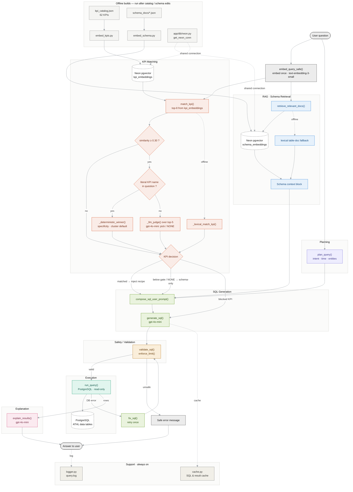

# System Processing Flow (current — implemented)

> The whole "Ask the Data" pipeline, one question → one answer, at module altitude.
> The question is embedded **once** (`embed_query_safe`) and that vector is shared by both
> Neon `pgvector` reads — schema retrieval (`schema_embeddings`) and KPI matching
> (`kpi_embeddings`). Each dashed box is one subsystem. Compare with
> `kpi_processing_flow.md` (the KPI slice in detail).

## Subsystems (the boxes)
- **RAG · Schema Retrieval** (`retriever.py`, `embeddings.py`) — finds the few relevant table
  docs from Neon `schema_embeddings`; lexical token-overlap fallback when offline.
- **Planning** (`planner.py`) — rules-only `intent` / `time_grain` / `entities` (no model call).
- **KPI Matching** (`kpi_matcher.py`) — top-8 from `kpi_embeddings`, similarity gate, then either
  the deterministic resolver (literal KPI name present) or the **LLM judge** over the top-5
  (paraphrases), which can also answer **NONE** to fall back to schema-only.
- **SQL Generation** (`prompts.py`, `generate_sql.py`) — composes schema + plan + KPI recipe and
  generates one SELECT (`gpt-4o-mini`).
- **Safety / Validation** (`validator.py`) — SELECT/WITH only, blocks writes, appends `LIMIT`.
- **Execution** (`query_runner.py`) — runs read-only on PostgreSQL; returns rows or an error.
- **Explanation** (`explain_results.py`) — turns rows into a plain-English answer.
- **Support** (`cache.py`, `logger.py`) — SQL/result cache and the query log; always on.
- **Offline builds** (`embed_kpis.py`, `embed_schema.py`, `kpi_catalog.json`, `neon.py`) —
  hash-gated builds of the two pgvector indexes; persistent, so restarts don't re-embed.

## Execution sequence
1. Embed the question **once** and share the vector with both pgvector reads.
2. Retrieve schema context from Neon `schema_embeddings` (lexical fallback offline).
3. Build the deterministic plan (`intent`, `time_grain`, entities).
4. Retrieve top-8 KPI candidates; apply the 0.30 similarity gate.
5. Resolve: literal KPI name → deterministic winner; otherwise the LLM judge picks one of the
   top-5 or NONE; judge unavailable → deterministic winner. Apply the leaderboard guardrail.
6. Compose the prompt (schema + plan + optional KPI recipe) and generate SQL — or a blocked
   message for blocked KPIs.
7. Validate + `LIMIT`, execute read-only; on a DB error, `fix_sql()` retries once.
8. Explain the rows in plain English and return the answer.

## Reduced detail (kept off this diagram)
- Per-function helpers inside each module (e.g. `_pgvector_table_docs`, `_resolve_candidates`,
  `_get_pool`) — see the interactive System Map for the function-level drill-down.
- The eval harnesses (`app/eval/*`) and Streamlit documentation tabs are out of scope here.
